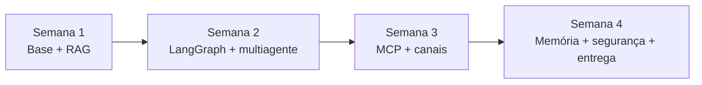

# Comece aqui

> **Tempo:** 10 min · **Pré-requisitos:** nenhum

## 🎯 Objetivo
Entender como este curso funciona, o que você vai construir e em que ordem.

## 🗺️ O mapa inteiro

O curso tem 4 semanas (cerca de 1 hora por dia, segunda a sexta). Você constrói **um projeto**: um agente que revisa pull requests de apps React Native/Expo.

| Semana | O que você aprende | Lições |
|---|---|---|
| 1 | Python moderno, LLM, tools, saída estruturada, RAG, Qdrant, Docker | 01, 02, 03 |
| 2 | LangGraph, aprovação humana, multiagente | 04, 05 |
| 3 | MCP, canais (CLI, API, webhook) | 06, 07 |
| 4 | LangMem, segurança, testes/evals, entrega | 08, 09, 10, 11 |
| Extra | Entrevista e glossário | 12, 13 |

## 📖 Como cada lição é organizada
Todas as lições têm **a mesma estrutura, na mesma ordem**. Você sempre sabe onde está.

1. **🎯 Objetivo**: uma frase.
2. **🗺️ Mapa**: o todo antes das partes (diagrama ou lista).
3. **📖 Conceito**: definição exata, depois o porquê, depois o como.
4. **💻 Código explicado**: código curto, com explicação linha por linha.
5. **⚠️ Armadilhas**: o que costuma dar errado.
6. **🔨 Tarefa no projeto**: o que você escreve. Você escreve a parte central.
7. **✅ Checagem**: perguntas com resposta escondida. Responda antes de abrir.
8. **💼 Liga com a vaga**: como isso aparece em entrevista.

Os blocos **"Aprofundar"** (setas ▶) escondem detalhes extras. Abra só se quiser. Nada essencial está escondido.

## 💡 Regras do curso
- Um conceito novo por vez.
- O código mostrado é um **ponto de partida**. Versões de bibliotecas mudam. Quando houver dúvida, rode `uv run python -c "import X; print(X.__version__)"` e leia a documentação oficial.
- Se travar: leia a dica, depois a resposta. Nessa ordem.
- Seu progresso fica salvo **neste navegador** (caixinha "Concluída" no fim de cada lição).

## 🎛️ Ajustes de conforto
No topo da página (ícone ⚙️): tema claro, escuro ou calmo (cores suaves), tamanho da letra, largura do texto, redução de animações e modo foco (esconde o menu lateral).

## ✅ Checagem

1. Quantas semanas tem o curso e qual é o projeto?

4 semanas. O projeto é um agente que revisa pull requests de apps React Native/Expo.

2. Em que ordem aparecem as seções de cada lição?

Objetivo, Mapa, Conceito, Código explicado, Armadilhas, Tarefa, Checagem, Liga com a vaga.

## 🔗 Próximo passo
Abra a lição **01 — Python moderno**.
