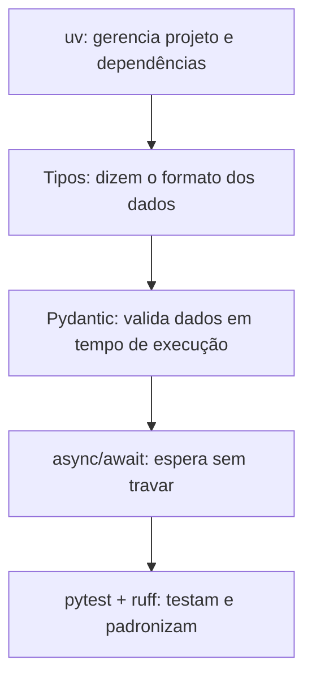

# 01 · Python moderno para agentes

> **Semana 1 · Tempo:** 2 sessões · **Pré-requisitos:** você já programa em TypeScript, então vamos comparar com ele.

## 🎯 Objetivo
Escrever Python com tipos, `async/await` e modelos Pydantic, e rodar testes e lint com `uv`.

## 🗺️ Mapa



## 📖 Conceito

### 1. `uv`
Ferramenta que cria o ambiente virtual, instala pacotes e roda comandos. Equivale a `npm` + `nvm` + `npx` juntos.

| Você quer | TypeScript | Python (uv) |
|---|---|---|
| instalar pacote | `npm i zod` | `uv add pydantic` |
| rodar script | `npx tsx a.ts` | `uv run python a.py` |
| rodar testes | `npm test` | `uv run pytest` |
| lockfile | `package-lock.json` | `uv.lock` |

### 2. Tipos (type hints)
Em Python, tipos são **anotações**. O interpretador **não os impõe**. Quem lê são editores, `ruff` e bibliotecas como Pydantic.

```python
def soma(a: int, b: int) -> int:
    return a + b

nome: str | None = None          # equivale a string | null
itens: list[str] = []            # equivale a string[]
mapa: dict[str, int] = {}        # equivale a Record<string, number>
```

### 3. Pydantic
Em TypeScript, `zod` valida dados em tempo de execução. Em Python, o equivalente é o **Pydantic**. Um `BaseModel` descreve campos e **rejeita** dados inválidos com `ValidationError`.

Por que isso importa para agentes: a resposta de um LLM é texto. Você precisa **transformar texto em dados confiáveis**. Pydantic faz essa ponte.

### 4. `async/await`
Uma chamada de rede (LLM, banco) fica esperando resposta. Com `async`, o programa **faz outra coisa enquanto espera**. É igual ao `async/await` do JavaScript, com uma diferença: precisa de um **event loop** iniciado por você (`asyncio.run`).

## 💻 Código explicado

```python
# src/rn_pr_review_agent/models.py
from enum import StrEnum
from pydantic import BaseModel, Field


class Severity(StrEnum):          # (1)
    INFO = "info"
    WARNING = "warning"
    CRITICAL = "critical"


class Category(StrEnum):
    PERFORMANCE = "performance"
    RERENDER = "rerender"
    STATE = "state"
    A11Y = "a11y"
    SECURITY = "security"


class Finding(BaseModel):         # (2)
    file: str
    line: int | None = None       # (3)
    severity: Severity
    category: Category
    message: str = Field(min_length=10)   # (4)


class Review(BaseModel):
    summary: str
    findings: list[Finding] = []
```

1. `StrEnum`: valores fixos que também são strings. Parecido com `enum` de string em TS.
2. `BaseModel`: a classe base do Pydantic. Cada atributo anotado vira um campo validado.
3. `int | None = None`: campo opcional, com valor padrão `None`.
4. `Field(min_length=10)`: regra extra de validação. Mensagem com menos de 10 caracteres é rejeitada.

```python
# async mínimo
import asyncio

async def buscar(nome: str) -> str:
    await asyncio.sleep(1)        # simula espera de rede
    return f"resultado de {nome}"

async def main() -> None:
    # as duas esperas acontecem ao mesmo tempo: total ≈ 1s, não 2s
    a, b = await asyncio.gather(buscar("a"), buscar("b"))
    print(a, b)

asyncio.run(main())
```

```python
# tests/test_models.py
import pytest
from pydantic import ValidationError
from rn_pr_review_agent.models import Finding


def test_finding_valido() -> None:
    f = Finding(file="App.tsx", severity="warning", category="rerender",
                message="Componente recria função a cada render.")
    assert f.line is None


def test_severidade_invalida() -> None:
    with pytest.raises(ValidationError):
        Finding(file="App.tsx", severity="gravissimo", category="state",
                message="mensagem longa o bastante")
```

<details><summary>▶ Aprofundar: Pydantic v2 em 5 pontos</summary>

- `Model.model_validate(dict)` valida um dicionário. `Model.model_validate_json(str)` valida JSON.
- `obj.model_dump()` volta para dicionário. `obj.model_dump_json()` volta para JSON.
- `Model.model_json_schema()` gera o JSON Schema. **É isso que o LLM recebe** para saber o formato da resposta.
- `pydantic-settings` (`BaseSettings`) lê variáveis de ambiente e `.env` com validação.
- Validadores customizados: `@field_validator("campo")`.
</details>

## ⚠️ Armadilhas
- **Tipos não são checados ao rodar.** `soma("a", "b")` roda. Use `ruff` e leia erros do Pydantic.
- **Lista como valor padrão mutável** em classe comum (`def f(x=[])`) compartilha estado. Em Pydantic isso é seguro, em funções comuns não.
- **Esquecer `await`**: a função devolve uma *coroutine*, não o resultado. Sintoma: aviso `coroutine was never awaited`.
- **Chamar `asyncio.run` dentro de código já assíncrono** causa erro.
- **Bloquear o loop**: `time.sleep(5)` dentro de `async def` trava tudo. Use `await asyncio.sleep(5)`.

## 🔨 Tarefa no projeto
1. Crie `src/rn_pr_review_agent/models.py` com `Severity`, `Category`, `Finding`, `Review` (sem copiar o código acima: tente primeiro).
2. Crie `tests/test_models.py` com 2 testes: um válido e um com severidade inválida.
3. Rode `uv run pytest` e `uv run ruff check .`.
4. Commit pequeno: `feat: add review models`.

**Dica 1:** a validação acontece quando você **cria** o objeto, não depois.
**Dica 2:** `pytest.raises(ValidationError)` captura o erro esperado.

## ✅ Checagem
<details><summary>1. Python impõe os tipos anotados ao executar?</summary>

Não. Os tipos são anotações. Quem os usa são o editor, o `ruff` e bibliotecas como o Pydantic.
</details>

<details><summary>2. Qual é a função do Pydantic em um agente?</summary>

Transformar a resposta em texto do LLM em dados validados e tipados, rejeitando formatos inválidos.
</details>

<details><summary>3. O que acontece se você esquecer o <code>await</code> numa função async?</summary>

Você recebe um objeto coroutine em vez do resultado, e o Python avisa "coroutine was never awaited".
</details>

## 💼 Liga com a vaga
"Domínio de Python para agentes inteligentes". Em entrevista, explique **por que** validar saída de LLM com Pydantic e **quando** usar async (chamadas de rede em paralelo).
