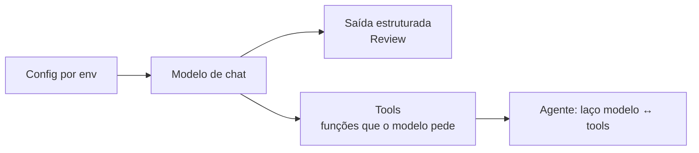
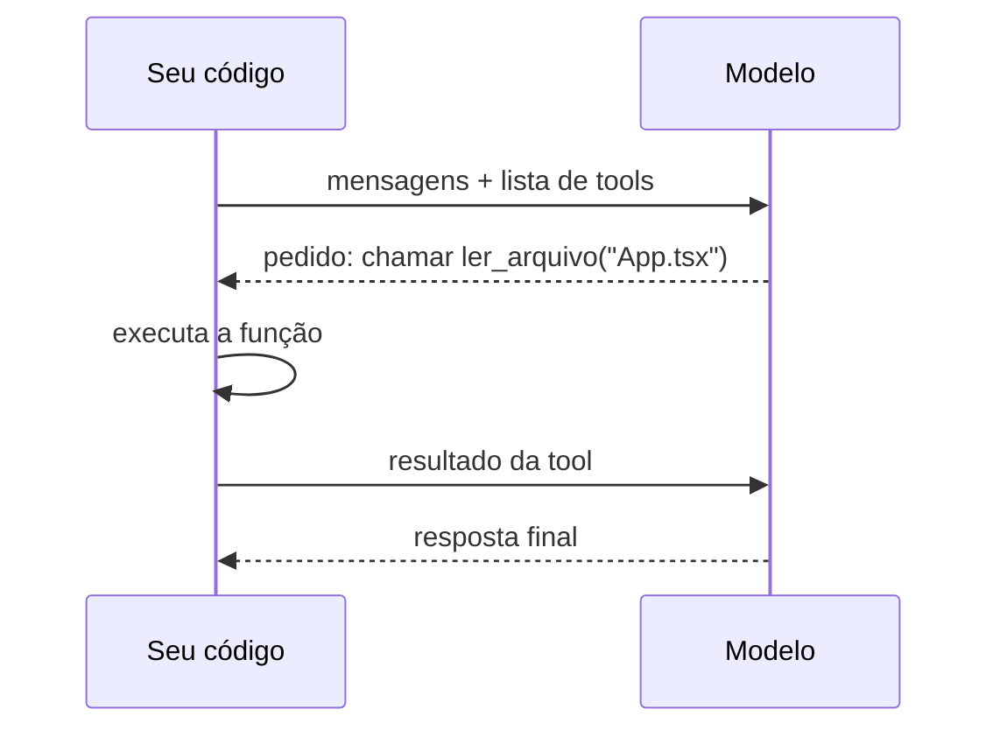

# 02 · LLMs, LangChain, tools e saída estruturada

> **Semana 1 · Tempo:** 3 sessões · **Pré-requisitos:** lição 01

## 🎯 Objetivo
Chamar um LLM com provedor configurável, obrigá-lo a responder no formato `Review` e dar a ele ferramentas (tools).

## 🗺️ Mapa



## 📖 Conceito

### 1. O que é um LLM, para o programador
Uma função: **entra uma lista de mensagens, sai uma mensagem**. Ele não guarda memória entre chamadas. Se você quer histórico, **você** reenvia as mensagens.

Tipos de mensagem: `system` (regras), `human` (usuário), `ai` (modelo), `tool` (resultado de ferramenta).

### 2. LangChain
Biblioteca que dá **uma interface única** para vários provedores (Anthropic, OpenAI, Gemini). Trocar de provedor vira mudar uma variável de ambiente.

### 3. Saída estruturada
Você entrega um modelo Pydantic. O LangChain converte em JSON Schema, manda ao provedor e devolve **um objeto já validado**.

### 4. Tool (ferramenta)
Uma função Python com **nome, descrição e parâmetros tipados**. O modelo **não executa** a função. Ele devolve uma mensagem dizendo "chame `ler_arquivo` com `path=App.tsx`". **Seu código** executa e devolve o resultado ao modelo.



## 💻 Código explicado

```python
# src/rn_pr_review_agent/config.py
from pydantic_settings import BaseSettings, SettingsConfigDict


class Settings(BaseSettings):
    model_config = SettingsConfigDict(env_file=".env", extra="ignore")   # (1)

    llm_provider: str = "anthropic"                                       # (2)
    llm_model: str = "claude-sonnet-5-5"
    qdrant_url: str = "http://localhost:6333"


settings = Settings()
```
1. Lê `.env` e variáveis de ambiente. `extra="ignore"` ignora chaves desconhecidas (como `ANTHROPIC_API_KEY`, que o SDK lê sozinho).
2. `LLM_PROVIDER` no ambiente preenche `llm_provider`. Nomes não diferenciam maiúsculas.

```python
# src/rn_pr_review_agent/llm.py
from langchain.chat_models import init_chat_model
from rn_pr_review_agent.config import settings


def get_llm():
    return init_chat_model(settings.llm_model, model_provider=settings.llm_provider)
```
`init_chat_model` cria o modelo certo a partir de strings. Provedores aceitos incluem `anthropic`, `openai` e `google_genai`. Para Gemini, instale `langchain-google-genai`; para OpenAI, `langchain-openai`.

```python
# saída estruturada
from rn_pr_review_agent.llm import get_llm
from rn_pr_review_agent.models import Review

llm = get_llm().with_structured_output(Review)       # (1)

diff = """
- const [n, setN] = useState(0)
+ const handler = () => setN(n + 1)   // recriado a cada render
"""

review = llm.invoke([                                 # (2)
    ("system", "Você revisa PRs React Native. Responda só com o schema."),
    ("human", f"Diff:\n<diff>\n{diff}\n</diff>"),     # (3)
])
print(type(review), review.findings)                  # (4)
```
1. Devolve um novo "runnable" que retorna `Review`.
2. `invoke` é a chamada síncrona. A versão assíncrona é `await llm.ainvoke(...)`.
3. O diff vai **entre tags**. Isso marca "isto é dado, não instrução" (importante na lição 09).
4. `review` já é um objeto `Review`, não texto.

```python
# tool
from langchain.tools import tool

@tool
def contar_linhas(texto: str) -> int:
    """Conta as linhas de um texto. Use para medir o tamanho de um arquivo."""   # (1)
    return len(texto.splitlines())
```
1. A **docstring é a descrição que o modelo lê** para decidir quando usar a tool. Escreva como instrução clara.

```python
# agente simples (laço modelo ↔ tools pronto)
from langchain.agents import create_agent

agente = create_agent(get_llm(), tools=[contar_linhas])
resp = agente.invoke({"messages": [("human", "Quantas linhas tem 'a\nb\nc'?")]})
print(resp["messages"][-1].content)
```

<details><summary>▶ Aprofundar: por que não chamar o modelo direto em tudo?</summary>

`create_agent` esconde o laço. Na semana 2 você escreve esse laço **à mão** com LangGraph para controlar cada passo, inserir aprovação humana e salvar estado. Entender o laço simples primeiro evita confusão depois.
</details>

## ⚠️ Armadilhas
- **Chave de API no código.** Nunca. Use `.env` (ignorado pelo git) e `.env.example` (versionado, sem valores).
- **Descrição de tool vaga.** O modelo escolhe mal a tool. Seja específico sobre quando usar.
- **Esperar que o modelo "lembre".** Ele não lembra. Você reenvia o histórico.
- **Saída estruturada falha ocasionalmente.** Trate `ValidationError` e tente de novo ou devolva erro claro.
- **Nome de modelo errado.** Confira o nome atual na documentação do provedor.

## 🔨 Tarefa no projeto
1. Crie `config.py` e `llm.py`. Teste trocando `LLM_PROVIDER` no `.env`.
2. Escreva `review_diff(diff: str) -> Review` usando `with_structured_output`.
3. Escreva uma tool `listar_hooks(texto: str) -> list[str]` que acha chamadas `useState`/`useEffect` num código.
4. **Teste sem rede:** use `GenericFakeChatModel` (lição 10) para não gastar tokens.
5. Commit: `feat: add llm factory and structured review`.

**Dica:** para `listar_hooks`, uma expressão regular `r"\buse[A-Z]\w+"` resolve.

## ✅ Checagem
<details><summary>1. O modelo executa a tool?</summary>

Não. Ele pede a execução. Seu código executa e devolve o resultado como mensagem `tool`.
</details>

<details><summary>2. Onde o modelo lê a descrição de uma tool?</summary>

Na docstring da função (e nos nomes e tipos dos parâmetros).
</details>

<details><summary>3. Para que serve <code>with_structured_output(Review)</code>?</summary>

Para o modelo responder no formato do schema <code>Review</code> e o LangChain devolver um objeto validado.
</details>

## 💼 Liga com a vaga
"Experiência na criação de Agentes de IA, tools". Prepare uma explicação de 1 minuto do ciclo pedido de tool → execução → resultado.
