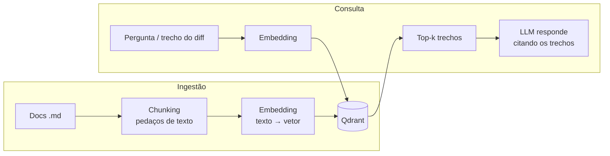

# 03 · RAG, embeddings, Qdrant e Docker

> **Semana 1 · Tempo:** 3 sessões · **Pré-requisitos:** lições 01 e 02

## 🎯 Objetivo
Indexar a documentação de React Native/Expo em um banco vetorial (Qdrant, rodando no Docker) e buscar trechos relevantes com uma avaliação simples de qualidade.

## 🗺️ Mapa



## 📖 Conceito

### 1. Por que RAG
O LLM foi treinado até uma data e não conhece sua documentação privada ou recente. **RAG** (Retrieval-Augmented Generation) = **buscar** trechos relevantes e **colocá-los no prompt**. Benefícios: respostas com fonte, menos invenção, conteúdo atualizável sem retreinar.

### 2. Embedding
Uma função que transforma texto em uma **lista de números** (vetor, por exemplo 384 números). Textos com **sentido parecido** geram vetores **próximos**.

### 3. Distância
Mede quão próximos dois vetores estão. Mais comum: **cosseno** (compara direção, de -1 a 1).

### 4. Banco vetorial
Armazena vetores + **payload** (metadados: arquivo, título, URL) e acha os mais próximos rápido. Qdrant é um deles. Alternativa: pgvector (Postgres).

### 5. Chunking
Documentos grandes são cortados em pedaços. Pedaço grande demais mistura assuntos; pequeno demais perde contexto. Ponto de partida: 500–1000 caracteres com sobreposição (overlap) de 10–20%. **Medir é melhor que adivinhar** (item 6).

### 6. Avaliação simples (hit rate)
Crie 15–30 pares **pergunta → arquivo que deveria aparecer**. Para cada pergunta, busque o top-5. **Hit rate** = proporção de perguntas em que o arquivo certo apareceu. Mude o chunking, rode de novo, compare.

## 💻 Código explicado

```yaml
# docker-compose.yml  (só o Qdrant por enquanto)
services:
  qdrant:
    image: qdrant/qdrant
    ports:
      - "6333:6333"          # API HTTP
    volumes:
      - qdrant_data:/qdrant/storage   # dados sobrevivem a reinícios
volumes:
  qdrant_data:
```
Comando: `docker compose up -d`. Teste: abrir `http://localhost:6333/dashboard`.

```python
# src/rn_pr_review_agent/rag/chunking.py
def chunk_text(text: str, size: int = 800, overlap: int = 120) -> list[str]:
    chunks, start = [], 0
    while start < len(text):
        chunks.append(text[start:start + size])
        start += size - overlap          # (1)
    return chunks
```
1. Avança `size - overlap`, então cada pedaço repete o final do anterior.

```python
# src/rn_pr_review_agent/rag/store.py
from fastembed import TextEmbedding
from qdrant_client import QdrantClient
from qdrant_client.models import Distance, PointStruct, VectorParams

COLLECTION = "rn_docs"
embedder = TextEmbedding("BAAI/bge-small-en-v1.5")      # (1) roda local, sem chave
client = QdrantClient(url="http://localhost:6333")


def ensure_collection() -> None:
    if not client.collection_exists(COLLECTION):
        client.create_collection(
            COLLECTION,
            vectors_config=VectorParams(size=384, distance=Distance.COSINE),   # (2)
        )


def index(chunks: list[str], source: str) -> None:
    vectors = list(embedder.embed(chunks))                # (3)
    points = [
        PointStruct(id=i, vector=v.tolist(), payload={"text": c, "source": source})
        for i, (c, v) in enumerate(zip(chunks, vectors))
    ]
    client.upsert(COLLECTION, points)


def search(query: str, k: int = 5):
    qv = next(iter(embedder.embed([query]))).tolist()
    return client.query_points(COLLECTION, query=qv, limit=k).points   # (4)
```
1. `fastembed` roda localmente. O modelo tem **384 dimensões**.
2. O `size` da coleção **precisa** ser igual à dimensão do modelo de embedding.
3. `embed` devolve um gerador; `list()` materializa.
4. Cada resultado tem `.score` e `.payload` (com `text` e `source`).

> ⚠️ Os ids acima começam em 0 para cada `source` e se sobrescrevem. Na tarefa, gere ids únicos (por exemplo `uuid5` de `source + índice`).

```python
# avaliação mínima
CASES = [
    ("Como evitar re-render em FlatList?", "flatlist.md"),
    ("Como pedir permissão de câmera no Expo?", "camera.md"),
]

def hit_rate(k: int = 5) -> float:
    hits = 0
    for question, expected in CASES:
        sources = [p.payload["source"] for p in search(question, k)]
        hits += expected in sources
    return hits / len(CASES)
```

## ⚠️ Armadilhas
- **Dimensão errada** na coleção → erro ao inserir.
- **Trocar o modelo de embedding sem reindexar.** Vetores de modelos diferentes não são comparáveis.
- **IDs repetidos** sobrescrevem pontos silenciosamente.
- **Docker não iniciado**: `Connection refused` em `localhost:6333`.
- **Documentação em outro idioma**: use embedding multilíngue se misturar português e inglês.
- **Confiar no RAG como verdade.** O texto recuperado também é **dado não confiável** (lição 09).

## 🔨 Tarefa no projeto
1. Instale o Docker Desktop. Suba o Qdrant com o compose.
2. Baixe 10–20 páginas da documentação do React Native/Expo (Markdown) para uma pasta `data/docs/` (**não commite se a licença não permitir**; commite só o script de download).
3. Escreva a ingestão: ler → `chunk_text` → `index`.
4. Escreva 15 casos de avaliação e calcule `hit_rate`. Registre a taxa **real** no seu caderno. Nunca invente números no README.
5. Commit: `feat: add qdrant ingestion and retrieval eval`.

## ✅ Checagem
<details><summary>1. O que significa a sigla RAG?</summary>

Retrieval-Augmented Generation: buscar trechos relevantes e incluí-los no prompt do modelo.
</details>

<details><summary>2. Por que a dimensão da coleção precisa bater com o modelo de embedding?</summary>

Porque cada vetor tem exatamente N números. O Qdrant rejeita vetores com tamanho diferente do declarado.
</details>

<details><summary>3. O que o hit rate mede?</summary>

A proporção de perguntas de teste em que o documento esperado apareceu entre os k primeiros resultados.
</details>

## 💼 Liga com a vaga
"Vivência com bancos vetoriais" e "Familiaridade com Docker". Em entrevista, conte **como você mediu** a qualidade da busca e o que mudou ao ajustar o chunking.
