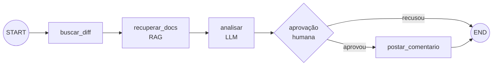

# 04 · LangGraph: estado, nós, checkpoint e aprovação humana

> **Semana 2 · Tempo:** 3 sessões · **Pré-requisitos:** lições 01–03

## 🎯 Objetivo
Montar o fluxo do revisor como um **grafo** que pausa para aprovação humana antes de escrever no GitHub e retoma do ponto exato.

## 🗺️ Mapa



## 📖 Conceito

### 1. Por que um grafo
Um agente simples é um laço escondido. Em produção você precisa: **ver cada passo**, **pausar**, **retomar depois de horas**, **repetir só um passo** e **testar cada parte**. Um grafo dá isso.

### 2. As 4 peças
| Peça | O que é | Analogia técnica |
|---|---|---|
| **State** | Dicionário tipado compartilhado | `store` do Redux |
| **Node** | Função: recebe o estado, devolve **mudanças** | reducer/handler |
| **Edge** | Ligação entre nós (fixa ou condicional) | transição de máquina de estados |
| **Checkpointer** | Salva o estado a cada passo | persistência de snapshot |

Regra central: um nó **não altera o estado diretamente**. Ele **devolve um dicionário com os campos que mudaram**, e o LangGraph mescla.

### 3. Reducers
Por padrão, devolver um campo **substitui** o valor. Para **acumular** (ex.: lista de achados vindos de vários nós), anote o campo com um reducer: `Annotated[list, operator.add]`.

### 4. Checkpoint e `thread_id`
Com um checkpointer, cada execução tem um `thread_id`. O estado fica salvo por thread. Você pode **retomar** a mesma thread depois.

### 5. `interrupt` (human-in-the-loop)
`interrupt(valor)` **para o grafo**, devolve `valor` ao chamador e espera. Você retoma com `Command(resume=resposta)`. O valor de `resume` vira o retorno de `interrupt(...)`.

> ⚠️ Ao retomar, o **nó inteiro roda de novo desde o início**. Por isso: **não coloque efeitos colaterais (postar, enviar e-mail) antes do `interrupt` no mesmo nó.**

## 💻 Código explicado

```python
# src/rn_pr_review_agent/graph.py
from typing import TypedDict
from langgraph.checkpoint.memory import InMemorySaver
from langgraph.graph import END, START, StateGraph
from langgraph.types import Command, interrupt


class State(TypedDict, total=False):                       # (1)
    diff: str
    comment: str
    approved: bool
    result: str


def analisar(state: State) -> dict:
    # aqui entra o LLM da lição 02; versão mínima:
    return {"comment": f"Revisão automática de {len(state['diff'])} caracteres."}   # (2)


def aprovacao(state: State) -> dict:
    decisao = interrupt({                                  # (3)
        "pergunta": "Postar este comentário?",
        "comentario": state["comment"],
    })
    return {"approved": bool(decisao)}                     # (4)


def postar(state: State) -> dict:
    # efeito colateral SÓ depois da aprovação
    return {"result": "comentário postado (simulado)"}


def rota(state: State) -> str:
    return "postar" if state["approved"] else END          # (5)


builder = StateGraph(State)
builder.add_node("analisar", analisar)
builder.add_node("aprovacao", aprovacao)
builder.add_node("postar", postar)
builder.add_edge(START, "analisar")
builder.add_edge("analisar", "aprovacao")
builder.add_conditional_edges("aprovacao", rota, ["postar", END])
builder.add_edge("postar", END)

graph = builder.compile(checkpointer=InMemorySaver())      # (6)
```
1. `TypedDict` define o formato do estado. `total=False` torna campos opcionais.
2. O nó devolve **só o que mudou**.
3. `interrupt` pausa e entrega esse dicionário a quem chamou o grafo.
4. Na retomada, `decisao` recebe o valor de `Command(resume=...)`.
5. Função de roteamento devolve o **nome do próximo nó** (ou `END`).
6. Sem checkpointer, `interrupt` não funciona.

```python
# usando o grafo
config = {"configurable": {"thread_id": "pr-42"}}          # (1)

saida = graph.invoke({"diff": "- a\n+ b"}, config)
print(saida["__interrupt__"][0].value)                     # (2) o que o humano vê

# humano decide (aqui: sim)
final = graph.invoke(Command(resume=True), config)        # (3)
print(final["result"])
```
1. Mesmo `thread_id` = mesma execução.
2. Quando pausado, o resultado traz a chave `__interrupt__`.
3. Retoma exatamente de `aprovacao`.

<details><summary>▶ Aprofundar: checkpointers de verdade</summary>

`InMemorySaver` perde tudo quando o processo termina. Para produção use um checkpointer persistente (SQLite ou Postgres, pacotes `langgraph-checkpoint-sqlite` e `langgraph-checkpoint-postgres`). Assim, o humano pode aprovar **amanhã**, mesmo que o servidor reinicie.
</details>

<details><summary>▶ Aprofundar: streaming</summary>

`graph.stream(entrada, config, stream_mode="updates")` emite uma atualização por nó. Útil para mostrar progresso na interface.
</details>

## ⚠️ Armadilhas
- **Efeito colateral antes do `interrupt`** repete na retomada (ex.: postar duas vezes).
- **Esquecer o checkpointer**: erro ao usar `interrupt`.
- **Esquecer o `thread_id`**: erro de configuração.
- **Nó que devolve o estado inteiro**: funciona, mas sobrescreve campos e esconde bugs. Devolva só mudanças.
- **Valor de `interrupt` não serializável**: use dados simples (str, dict, list).
- **Rota devolvendo nome inexistente**: erro na compilação ou execução.

## 🔨 Tarefa no projeto
1. Reproduza o grafo acima **sem copiar**: comece só com `analisar` → `END`.
2. Troque `analisar` pela chamada real `review_diff` (lição 02).
3. Adicione `recuperar_docs` (RAG, lição 03) antes de `analisar`.
4. Adicione `aprovacao` e `postar` (simulado).
5. Escreva um teste que: roda até a pausa, confere `__interrupt__`, retoma com `False` e confere que `result` **não existe**; depois retoma com `True` em outra thread e confere `result`.
6. Commit: `feat: add review graph with human approval`.

**Dica:** para testar sem LLM, injete uma função `analisar` falsa ao montar o grafo (receba dependências por parâmetro em `build_graph(analisar)`).

## ✅ Checagem
<details><summary>1. O que um nó devolve?</summary>

Um dicionário com os campos do estado que mudaram. O LangGraph mescla no estado.
</details>

<details><summary>2. O que acontece com o nó ao retomar depois de um interrupt?</summary>

Ele roda de novo desde o início. O <code>interrupt</code> então devolve o valor de <code>resume</code>.
</details>

<details><summary>3. Por que o checkpointer é obrigatório para interrupt?</summary>

Porque o estado precisa estar salvo para o grafo poder pausar e retomar do mesmo ponto.
</details>

<details><summary>4. Como acumular resultados de vários nós numa lista?</summary>

Anotando o campo com um reducer, por exemplo <code>Annotated[list, operator.add]</code>.
</details>

## 💼 Liga com a vaga
"Desenvolver agentes com LangGraph" e "Orquestrar fluxos dinâmicos". Prepare: por que grafo em vez de laço, o que é checkpoint, como funciona human-in-the-loop e qual a armadilha do `interrupt`.
