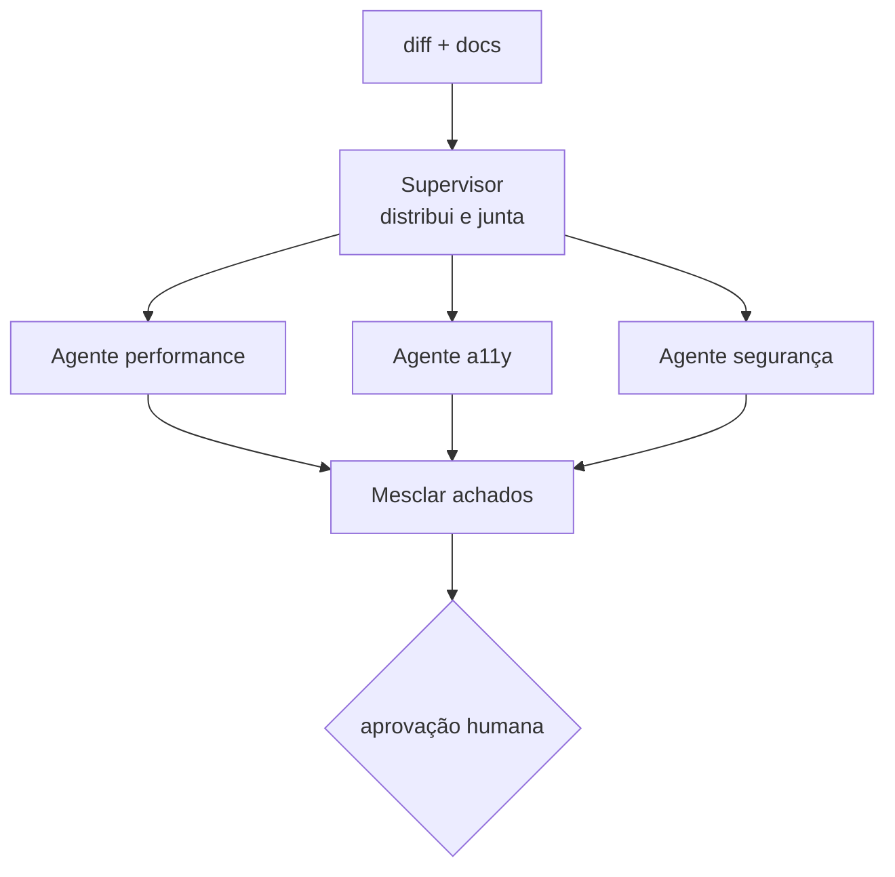

# 05 · Multiagente e agente-para-agente

> **Semana 2 · Tempo:** 2 sessões · **Pré-requisitos:** lição 04

## 🎯 Objetivo
Dividir a revisão em **subagentes especialistas** (performance, acessibilidade, segurança) coordenados por um supervisor, e entender como agentes conversam entre si.

## 🗺️ Mapa



## 📖 Conceito

### 1. Por que vários agentes
- Cada um tem **prompt curto e focado** → melhor qualidade que um prompt gigante.
- Cada um tem **tools mínimas** → menor risco (lição 09).
- Cada um pode usar **modelo diferente** (barato para triagem, forte para análise).
- Podem rodar **em paralelo**.

Custo: mais chamadas ao LLM (mais dinheiro e latência) e mais coisas para testar. **Só divida se a qualidade melhorar. Meça.**

### 2. Padrões
| Padrão | Como funciona | Quando usar |
|---|---|---|
| **Fan-out / fan-in** | Vários nós em paralelo, um nó junta | Tarefas independentes (nosso caso) |
| **Supervisor** | Um LLM decide qual agente chama em seguida | Rota depende do conteúdo |
| **Subgrafo** | Um grafo inteiro vira nó de outro | Reutilizar um agente como módulo |
| **Handoff** | Um agente passa o controle a outro | Conversas com especialistas |

### 3. Agente-para-agente entre sistemas
Quando os agentes rodam **em serviços diferentes**, eles precisam de um protocolo. Dois nomes que aparecem em vagas:
- **MCP** (Model Context Protocol): conecta **modelo ↔ ferramentas/dados** (lição 06).
- **A2A** (Agent2Agent): conecta **agente ↔ agente** de organizações ou serviços diferentes (Agent Card, tarefas, mensagens). Você não precisa implementar; precisa saber **a diferença**.

Dentro do seu projeto, o jeito mais simples é **um agente expor outro como tool** (via MCP ou função).

## 💻 Código explicado

```python
# fan-out / fan-in com reducer
import operator
from typing import Annotated, TypedDict
from langgraph.graph import END, START, StateGraph

from rn_pr_review_agent.models import Finding


class RState(TypedDict, total=False):
    diff: str
    findings: Annotated[list[Finding], operator.add]      # (1)


def agente_perf(state: RState) -> dict:
    return {"findings": [...]}      # lista de Finding de performance


def agente_a11y(state: RState) -> dict:
    return {"findings": [...]}


def agente_seguranca(state: RState) -> dict:
    return {"findings": [...]}


def mesclar(state: RState) -> dict:
    ordenados = sorted(state["findings"], key=lambda f: f.severity, reverse=True)   # (2)
    return {"findings": ordenados}   # ⚠ com operator.add isso SOMA de novo; veja nota


b = StateGraph(RState)
for nome, fn in [("perf", agente_perf), ("a11y", agente_a11y), ("seg", agente_seguranca)]:
    b.add_node(nome, fn)
    b.add_edge(START, nome)         # (3) três arestas saindo de START = paralelo
    b.add_edge(nome, "mesclar")     # (4) "mesclar" espera todos terminarem
b.add_node("mesclar", mesclar)
b.add_edge("mesclar", END)
graph = b.compile()
```
1. `operator.add` concatena listas. Os três nós paralelos escrevem em `findings` sem se sobrescrever.
2. Ordena por severidade. (Os valores de `StrEnum` ordenam como texto; na tarefa, crie uma ordem explícita.)
3. Arestas de `START` para vários nós = execução em paralelo.
4. Um nó com várias arestas entrando espera todas.

> ⚠️ **Nota:** com o reducer `operator.add`, devolver `{"findings": ordenados}` em `mesclar` **acrescenta** de novo em vez de substituir. Solução: guardar o resultado final em **outro campo** (`final_findings`) sem reducer. Esse é um erro comum e bom para você descobrir rodando.

```python
# subgrafo como nó
sub = b.compile()                       # o grafo de revisão vira um objeto

pai = StateGraph(RState)
pai.add_node("revisao", sub)            # grafo compilado pode ser nó
pai.add_edge(START, "revisao")
pai.add_edge("revisao", END)
```

<details><summary>▶ Aprofundar: supervisor com LLM</summary>

O supervisor é um nó que chama o LLM com saída estruturada `{"proximo": "perf" | "a11y" | "seg" | "fim"}` e uma aresta condicional lê esse campo. Vantagem: roteamento dinâmico. Desvantagem: o LLM pode escolher errado ou entrar em laço. **Sempre** coloque limite de passos (`recursion_limit`).
</details>

## ⚠️ Armadilhas
- **Reducer + sobrescrita** (nota acima).
- **Paralelismo e ordem**: não dependa da ordem de término dos nós paralelos.
- **Custo multiplicado**: 3 agentes = 3 chamadas. Meça tokens.
- **Laços infinitos** em supervisores. Defina limite.
- **Agentes que se influenciam por texto**: o que um agente escreve vira entrada de outro. Trate como dado não confiável (lição 09).

## 🔨 Tarefa no projeto
1. Crie 3 nós especialistas, cada um com **prompt próprio** e saída `list[Finding]`.
2. Ligue em paralelo e junte com reducer. Evite o erro da nota.
3. Compare a qualidade: 1 agente com prompt geral vs. 3 especialistas, em 5 diffs de exemplo. **Anote o que observou** (sem inventar número).
4. Encaixe o subgrafo no grafo da lição 04, antes da aprovação.
5. Commit: `feat: add specialist review agents`.

## ✅ Checagem
<details><summary>1. Qual a diferença entre MCP e A2A?</summary>

MCP conecta modelo a ferramentas e dados. A2A conecta um agente a outro agente.
</details>

<details><summary>2. Como rodar três nós em paralelo no LangGraph?</summary>

Criando uma aresta de START (ou de um mesmo nó) para cada um deles, e usando um reducer no campo compartilhado.
</details>

<details><summary>3. Cite duas desvantagens de multiagente.</summary>

Mais custo e latência (mais chamadas ao LLM) e mais complexidade para testar e depurar.
</details>

## 💼 Liga com a vaga
"Integrar seus agentes com outros agentes." Prepare uma resposta: quando você **não** usaria multiagente e como mediria se vale a pena.
