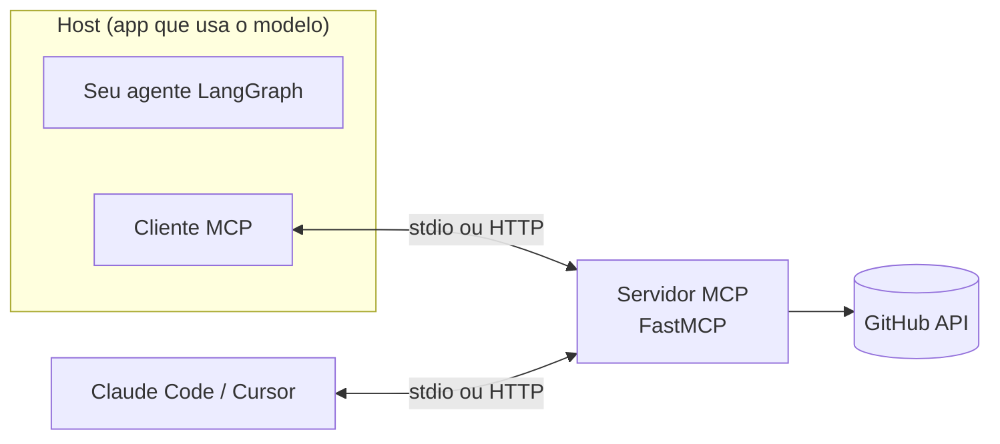

# 06 · MCP (Model Context Protocol)

> **Semana 3 · Tempo:** 3 sessões · **Pré-requisitos:** lições 02 e 04

## 🎯 Objetivo
Criar seu **servidor MCP** com FastMCP (ler diff, listar arquivos, postar comentário), consumi-lo no agente e conectá-lo ao Claude Code e ao Cursor.

> Nota: MCP significa **Model Context Protocol**. Algumas descrições de vaga escrevem "Message Context Protocol". O nome correto é Model Context Protocol.

## 🗺️ Mapa



## 📖 Conceito

### 1. O problema que o MCP resolve
Sem padrão, cada app de IA integra cada ferramenta de um jeito. Com MCP, **você escreve a ferramenta uma vez** e qualquer cliente compatível (seu agente, Claude Code, Cursor) usa.

### 2. Papéis
| Papel | O que é | Exemplo |
|---|---|---|
| **Host** | App que contém o modelo | Claude Code, Cursor, seu agente |
| **Client** | Parte do host que fala MCP | `langchain-mcp-adapters` |
| **Server** | Programa que expõe capacidades | Seu servidor FastMCP |

### 3. O que um servidor expõe
- **Tools**: ações que o modelo pode pedir (ler diff, postar comentário).
- **Resources**: dados que o host pode ler (um arquivo, um documento).
- **Prompts**: modelos de prompt reutilizáveis.

### 4. Transportes
- **stdio**: o host inicia o servidor como processo filho e conversa por entrada/saída padrão. Ideal para **local**.
- **HTTP (streamable HTTP)**: o servidor roda como serviço de rede. Ideal para **remoto/compartilhado**. Exige autenticação.

### 5. Segurança desde já
Tools de **leitura** e de **escrita** devem ser **separadas**. A tool de escrita nunca confia só no modelo: exige **token de aprovação** gerado pelo fluxo humano (lição 09).

## 💻 Código explicado

```python
# src/rn_pr_review_agent/mcp_server.py
import os
import httpx
from fastmcp import FastMCP

mcp = FastMCP("github-pr")                                  # (1)
API = "https://api.github.com"


def _headers() -> dict:
    token = os.environ["GITHUB_TOKEN"]                       # (2)
    return {"Authorization": f"Bearer {token}",
            "Accept": "application/vnd.github+json"}


@mcp.tool                                                    # (3)
def get_pr_diff(repo: str, pr_number: int) -> str:
    """Retorna o diff unificado de um pull request. Somente leitura.
    repo no formato 'dono/nome'."""                          # (4)
    r = httpx.get(f"{API}/repos/{repo}/pulls/{pr_number}",
                  headers={**_headers(), "Accept": "application/vnd.github.diff"})
    r.raise_for_status()
    return r.text


@mcp.tool
def list_changed_files(repo: str, pr_number: int) -> list[str]:
    """Lista os caminhos dos arquivos alterados no PR. Somente leitura."""
    r = httpx.get(f"{API}/repos/{repo}/pulls/{pr_number}/files", headers=_headers())
    r.raise_for_status()
    return [f["filename"] for f in r.json()]


@mcp.tool
def post_review_comment(repo: str, pr_number: int, body: str, approval_token: str) -> str:
    """ESCRITA. Posta um comentário no PR. Só funciona com approval_token válido."""
    if not _valid_token(approval_token, repo, pr_number, body):   # (5)
        raise ValueError("Aprovação humana ausente ou inválida.")
    r = httpx.post(f"{API}/repos/{repo}/issues/{pr_number}/comments",
                   headers=_headers(), json={"body": body})
    r.raise_for_status()
    return r.json()["html_url"]


if __name__ == "__main__":
    mcp.run()                                                # (6) stdio por padrão
```
1. Nome do servidor.
2. Token vem do **ambiente**, nunca do código. Use um token de **menor privilégio** (fine-grained, só o repositório necessário).
3. `@mcp.tool` registra a função. Nome, docstring e tipos viram o contrato.
4. A docstring é a descrição que o modelo lê. Diga se é leitura ou escrita.
5. `_valid_token` é **sua tarefa** (ideia: HMAC de `repo+pr+hash(body)` com segredo e validade curta, gerado só depois do `interrupt` aprovado).
6. `mcp.run()` sem argumentos usa stdio.

```python
# consumindo no agente (langchain-mcp-adapters)
import asyncio
from langchain_mcp_adapters.client import MultiServerMCPClient

async def carregar_tools():
    client = MultiServerMCPClient({
        "github-pr": {
            "transport": "stdio",
            "command": "uv",
            "args": ["run", "python", "-m", "rn_pr_review_agent.mcp_server"],
        }
    })
    tools = await client.get_tools()            # lista de tools LangChain
    # allowlist: só leitura vai para o modelo
    return [t for t in tools if t.name in {"get_pr_diff", "list_changed_files"}]   # (1)

tools = asyncio.run(carregar_tools())
```
1. **O modelo nunca recebe `post_review_comment`.** Só o nó `postar` do grafo (depois da aprovação) a chama.

```bash
# Claude Code: registrar o servidor local
claude mcp add github-pr -- uv run python -m rn_pr_review_agent.mcp_server
claude mcp list
```

```json
// Cursor: .cursor/mcp.json  (na raiz do projeto)
{
  "mcpServers": {
    "github-pr": {
      "command": "uv",
      "args": ["run", "python", "-m", "rn_pr_review_agent.mcp_server"],
      "env": { "GITHUB_TOKEN": "${env:GITHUB_TOKEN}" }
    }
  }
}
```

<details><summary>▶ Aprofundar: inspecionar o servidor</summary>

O **MCP Inspector** (`npx @modelcontextprotocol/inspector`) abre uma interface para listar e chamar as tools do seu servidor sem precisar de modelo. Use para depurar contrato e erros.
</details>

## ⚠️ Armadilhas
- **`print()` em servidor stdio** corrompe o protocolo (stdout é o canal). Use `logging` para **stderr**.
- **Token com permissão demais.** Use fine-grained, só o repo e só o necessário.
- **Descrição de tool que mente** (diz "leitura" mas escreve).
- **Expor tool de escrita ao modelo** sem trava.
- **Servidor HTTP sem autenticação.**
- **Versões**: a API do FastMCP evolui. Confirme na documentação oficial do pacote instalado.

## 🔨 Tarefa no projeto
1. Implemente as 3 tools. Comece por `get_pr_diff`.
2. Teste com o MCP Inspector.
3. Consuma no agente com allowlist (só leitura).
4. Implemente `_valid_token` e o nó `postar` que a usa.
5. Conecte ao Claude Code e ao Cursor e chame `get_pr_diff` por lá. Faça uma captura para a demo.
6. Commit: `feat: add FastMCP server for github PRs`.

## ✅ Checagem
<details><summary>1. Qual a diferença entre tool e resource no MCP?</summary>

Tool é uma ação que o modelo pode pedir. Resource é um dado que o host pode ler.
</details>

<details><summary>2. Quando usar stdio e quando HTTP?</summary>

stdio para servidores locais iniciados pelo host. HTTP para serviços remotos ou compartilhados, com autenticação.
</details>

<details><summary>3. Por que não usar print() em um servidor stdio?</summary>

Porque stdout é o canal do protocolo. Texto extra quebra as mensagens. Use logging em stderr.
</details>

<details><summary>4. Por que separar tools de leitura e de escrita?</summary>

Para aplicar menor privilégio: o modelo só recebe leitura, e a escrita só ocorre depois de aprovação humana.
</details>

## 💼 Liga com a vaga
"Conhecimento avançado de MCP" e "Cursor AI". Demonstre: servidor próprio, dois clientes diferentes usando o mesmo servidor, e a decisão de segurança sobre escrita.
