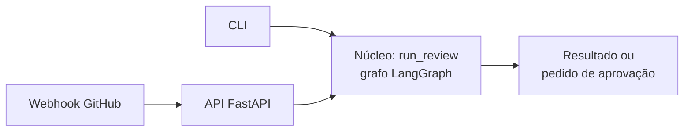

# 07 · Canais: CLI, API HTTP e webhook

> **Semana 3 · Tempo:** 2 sessões · **Pré-requisitos:** lição 04 e 06

## 🎯 Objetivo
Expor o mesmo agente por **três canais**: linha de comando, API HTTP e webhook do GitHub.

## 🗺️ Mapa



## 📖 Conceito

### 1. Canal = só uma porta de entrada
O **núcleo** (função `run_review(repo, pr)`) não sabe de onde veio o pedido. Cada canal só **traduz** entrada e saída. Isso evita duplicar lógica e facilita testar.

### 2. Multicanal na prática
No projeto: CLI para desenvolvedor, API para integrações, webhook para automatizar quando um PR é aberto. A mesma ideia vale para chat (Slack, WhatsApp): só muda o adaptador.

### 3. Webhook e assinatura
GitHub envia um `POST` quando algo acontece. Você **deve verificar a assinatura** (`X-Hub-Signature-256`): HMAC-SHA256 do corpo com um segredo compartilhado. Sem isso, qualquer pessoa pode disparar seu agente.

### 4. Fluxo com aprovação
1. `POST /reviews` → inicia, grafo pausa no `interrupt`, API devolve `thread_id` e o comentário proposto.
2. `POST /reviews/{thread_id}/decision` com `{"approve": true}` → retoma o grafo.

## 💻 Código explicado

```python
# src/rn_pr_review_agent/api.py
import hashlib, hmac, os
from fastapi import FastAPI, Header, HTTPException, Request
from pydantic import BaseModel
from langgraph.types import Command

from rn_pr_review_agent.graph import graph

app = FastAPI(title="rn-pr-review-agent")


class StartReview(BaseModel):
    repo: str
    pr_number: int


class Decision(BaseModel):
    approve: bool


@app.post("/reviews")
async def start(body: StartReview):
    thread = f"{body.repo}#{body.pr_number}"
    cfg = {"configurable": {"thread_id": thread}}
    out = await graph.ainvoke({"repo": body.repo, "pr_number": body.pr_number}, cfg)   # (1)
    pending = out.get("__interrupt__")
    return {"thread_id": thread, "pending": pending[0].value if pending else None}


@app.post("/reviews/{thread_id:path}/decision")
async def decide(thread_id: str, d: Decision):
    cfg = {"configurable": {"thread_id": thread_id}}
    out = await graph.ainvoke(Command(resume=d.approve), cfg)                          # (2)
    return {"result": out.get("result")}


def _assinatura_valida(corpo: bytes, header: str | None) -> bool:
    segredo = os.environ["GITHUB_WEBHOOK_SECRET"].encode()
    esperado = "sha256=" + hmac.new(segredo, corpo, hashlib.sha256).hexdigest()
    return header is not None and hmac.compare_digest(esperado, header)                # (3)


@app.post("/webhooks/github")
async def webhook(request: Request, x_hub_signature_256: str | None = Header(default=None)):
    corpo = await request.body()
    if not _assinatura_valida(corpo, x_hub_signature_256):
        raise HTTPException(status_code=401, detail="assinatura inválida")
    # ...extrair repo e número do PR do JSON e iniciar a revisão
    return {"ok": True}
```
1. `ainvoke` é a versão assíncrona. A API não trava enquanto espera o LLM.
2. Retoma a thread com a decisão humana.
3. `compare_digest` compara em tempo constante (evita ataque de temporização).

> Para o `ainvoke` funcionar com nós síncronos, o LangGraph os roda em threads. Nós `async def` são mais eficientes.

```python
# src/rn_pr_review_agent/cli.py
import argparse, asyncio

def main() -> None:
    p = argparse.ArgumentParser(prog="rn-pr-review-agent")
    p.add_argument("repo")
    p.add_argument("pr", type=int)
    args = p.parse_args()
    asyncio.run(run(args.repo, args.pr))          # run() usa o mesmo núcleo da API
```

```bash
uv run uvicorn rn_pr_review_agent.api:app --reload      # sobe a API local
curl -X POST localhost:8000/reviews -H "content-type: application/json" \
     -d '{"repo":"dono/nome","pr_number":42}'
```

## ⚠️ Armadilhas
- **Webhook sem verificar assinatura.**
- **Segredo do webhook no código.** Vai no ambiente.
- **Comparar assinatura com `==`.** Use `compare_digest`.
- **Responder o webhook só depois de 30 s de LLM.** O GitHub pode considerar timeout. Responda rápido (202) e processe em segundo plano.
- **Estado em memória com vários workers.** `InMemorySaver` não é compartilhado entre processos. Use checkpointer persistente.
- **`thread_id` com `/` na rota.** Por isso o `:path` no exemplo.

## 🔨 Tarefa no projeto
1. Extraia `run_review(repo, pr)` como núcleo único.
2. Faça a CLI chamar o núcleo e **perguntar `s/n` no terminal** para a aprovação.
3. Faça a API com os dois endpoints. Teste com `httpx` + `TestClient`.
4. Implemente a verificação de assinatura e **escreva testes**: assinatura correta, errada e ausente.
5. Commit: `feat: add cli, api and github webhook channels`.

## ✅ Checagem
<details><summary>1. Por que verificar a assinatura do webhook?</summary>

Para garantir que o pedido veio do GitHub. Sem isso, qualquer pessoa pode disparar seu agente.
</details>

<details><summary>2. O que é o "núcleo" e por que separá-lo dos canais?</summary>

É a função que executa a revisão sem depender do canal. Separar evita duplicar lógica e facilita testes.
</details>

<details><summary>3. Como a API implementa a aprovação humana?</summary>

O primeiro endpoint pausa no interrupt e devolve o pedido. O segundo recebe a decisão e retoma a mesma thread com Command(resume=...).
</details>

## 💼 Liga com a vaga
"Fluxos dinâmicos e conversacionais multicanal." Diga: "Um núcleo, vários adaptadores. Para adicionar Slack, escrevo só o adaptador."
