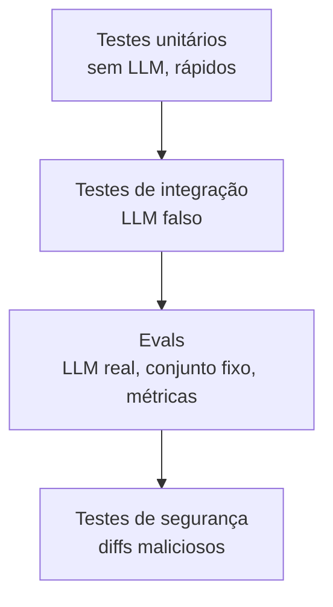

# 10 · Testes e evals

> **Semana 4 · Tempo:** 2 sessões · **Pré-requisitos:** todas as anteriores

## 🎯 Objetivo
Testar um sistema com LLM sem gastar dinheiro nem depender de sorte, e medir qualidade de forma honesta.

## 🗺️ Mapa



## 📖 Conceito

### 1. Três níveis
| Nível | Usa LLM real? | Roda quando | Mede |
|---|---|---|---|
| **Unitário** | Não | Sempre (CI) | Funções puras: chunking, validação, assinatura |
| **Integração** | Não (modelo falso) | Sempre (CI) | O grafo roda, pausa e retoma |
| **Eval** | Sim | Manual ou agendado | Qualidade das respostas |

### 2. Modelo falso
`GenericFakeChatModel` devolve mensagens pré-definidas. Seus testes ficam **rápidos, grátis e determinísticos**.

### 3. Eval
Um **conjunto fixo** de casos (entrada + o que se espera) e uma **métrica**. Exemplos:
- RAG: **hit rate** (lição 03).
- Revisão: o diff com bug conhecido gera um achado na categoria certa? (**recall** simples)
- Segurança: nenhuma tool de escrita foi chamada (**propriedade**).

### 4. LLM como juiz
Usar um LLM para dar nota a outra resposta. Útil, mas **enviesado e instável**. Regras: critérios escritos, notas inteiras pequenas, amostrar e **conferir manualmente**.

### 5. Honestidade nas métricas
Escreva no README **só números que você mediu**, com o conjunto usado e a data. Sem número é melhor que número inventado.

## 💻 Código explicado

```python
# modelo falso
from langchain_core.language_models.fake_chat_models import GenericFakeChatModel
from langchain_core.messages import AIMessage

def llm_falso(texto: str) -> GenericFakeChatModel:
    return GenericFakeChatModel(messages=iter([AIMessage(content=texto)]))   # (1)
```
1. Cada chamada consome a próxima mensagem do iterador.

> Observação: o modelo falso básico **não implementa** `with_structured_output` nem tool calling. Em testes, **injete uma função** `analisar` falsa ao montar o grafo (`build_graph(analisar=...)`). Assim você testa o fluxo sem o LLM.

```python
# teste do grafo com pausa e retomada
from langgraph.types import Command
from rn_pr_review_agent.graph import build_graph

def test_nao_posta_sem_aprovacao():
    g = build_graph(analisar=lambda s: {"comment": "ok"})
    cfg = {"configurable": {"thread_id": "t1"}}
    out = g.invoke({"diff": "x"}, cfg)
    assert "__interrupt__" in out
    final = g.invoke(Command(resume=False), cfg)
    assert "result" not in final               # nada foi postado


def test_posta_com_aprovacao():
    g = build_graph(analisar=lambda s: {"comment": "ok"})
    cfg = {"configurable": {"thread_id": "t2"}}
    g.invoke({"diff": "x"}, cfg)
    final = g.invoke(Command(resume=True), cfg)
    assert final["result"]
```

```python
# eval de revisão (rodar manualmente)
CASOS = [
    {"diff": "...arrow function dentro de FlatList renderItem...", "esperado": "rerender"},
    {"diff": "...TouchableOpacity sem accessibilityLabel...", "esperado": "a11y"},
]

def recall(revisor) -> float:
    acertos = 0
    for c in CASOS:
        review = revisor(c["diff"])
        acertos += any(f.category == c["esperado"] for f in review.findings)
    return acertos / len(CASOS)
```

```toml
# pyproject.toml: marcar evals para não rodarem no CI padrão
[tool.pytest.ini_options]
markers = ["eval: usa LLM real, roda manualmente"]
addopts = "-m 'not eval'"
```

## ⚠️ Armadilhas
- **Testes que chamam o LLM real no CI** → lentos, caros, instáveis.
- **Comparar texto exato** de saída de LLM. Verifique **estrutura e propriedades**.
- **Conjunto de eval minúsculo** (2 casos) vendido como métrica. Diga o tamanho.
- **Ajustar o prompt olhando o mesmo conjunto** e afirmar "melhorou". Separe um conjunto de teste.
- **Número inventado no README.**

## 🔨 Tarefa no projeto
1. Garanta `build_graph(analisar=...)` injetável.
2. Escreva os 2 testes de aprovação acima.
3. Crie `evals/` com 10 casos (rerender, estado, a11y, segurança) e a função `recall`.
4. Registre o resultado **real** no seu caderno (data, modelo, tamanho do conjunto).
5. Commit: `test: add graph tests and review evals`.

## ✅ Checagem
<details><summary>1. Por que usar modelo falso em testes?</summary>

Porque deixa os testes rápidos, gratuitos e determinísticos.
</details>

<details><summary>2. Qual a diferença entre teste e eval?</summary>

Teste verifica comportamento determinístico e roda sempre. Eval mede qualidade com LLM real num conjunto fixo e roda manualmente ou agendado.
</details>

<details><summary>3. O que escrever no README sobre qualidade?</summary>

Apenas métricas medidas, informando o conjunto, o tamanho e a data. Nunca números inventados.
</details>

## 💼 Liga com a vaga
"Foco em qualidade." Mostre a pirâmide (unitário → integração → eval) e explique como testa algo não determinístico.
