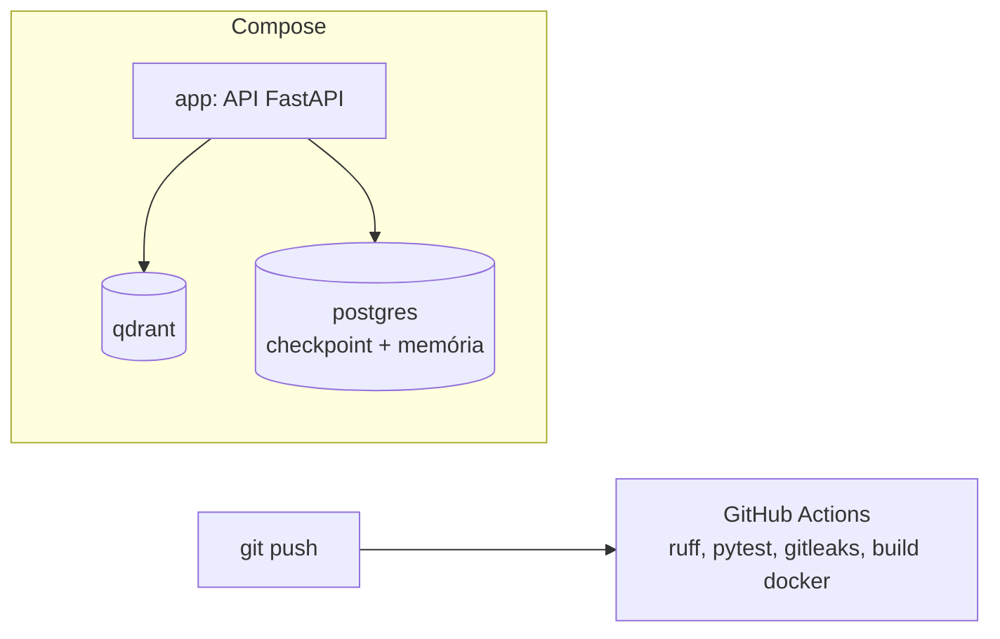

# 11 · Entrega: Docker Compose, CI, README e demo

> **Semana 4 · Tempo:** 3 sessões · **Pré-requisitos:** todas as anteriores

## 🎯 Objetivo
Entregar o projeto de forma que qualquer pessoa rode com **um comando**, com CI verde, README bilíngue honesto e uma demo curta.

## 🗺️ Mapa



## 📖 Conceito

### 1. Imagem e contêiner
- **Imagem**: receita empacotada (sistema + dependências + código).
- **Contêiner**: imagem em execução.
- **Compose**: arquivo que sobe **vários** contêineres juntos e os conecta por nome.

### 2. Boas práticas de Dockerfile
- Imagem base pequena (`python:3.12-slim`).
- Copiar **primeiro** os arquivos de dependência (aproveita cache).
- **Usuário não-root**.
- Nunca copiar `.env` (use `.dockerignore`).

### 3. CI
Roda a cada push: lint, testes, varredura de segredos, build da imagem. **Protege a main**: PR só entra com CI verde.

### 4. README que vende sem mentir
Ordem: o que é · demo (GIF/vídeo) · como rodar · arquitetura (diagrama) · decisões · segurança · limitações · próximos passos. Em **inglês e português**. Sem "produção" se não estiver, sem métricas inventadas.

## 💻 Código explicado

```dockerfile
# Dockerfile
FROM python:3.12-slim
COPY --from=ghcr.io/astral-sh/uv:latest /uv /bin/uv       # (1)
WORKDIR /app
COPY pyproject.toml uv.lock ./                             # (2)
RUN uv sync --locked --no-dev --no-install-project
COPY src ./src
RUN uv sync --locked --no-dev
RUN useradd -m app
USER app                                                   # (3)
CMD ["uv", "run", "uvicorn", "rn_pr_review_agent.api:app", "--host", "0.0.0.0", "--port", "8000"]
```
1. Traz o `uv` da imagem oficial.
2. Dependências antes do código: o cache só invalida se elas mudarem.
3. Não roda como root.

```yaml
# docker-compose.yml
services:
  app:
    build: .
    ports: ["8000:8000"]
    env_file: .env                    # (1)
    environment:
      QDRANT_URL: http://qdrant:6333  # (2)
    depends_on: [qdrant]
  qdrant:
    image: qdrant/qdrant
    volumes: [qdrant_data:/qdrant/storage]
volumes:
  qdrant_data:
```
1. Segredos vêm do `.env` local (fora do git).
2. Dentro do Compose, o host é o **nome do serviço**, não `localhost`.

```yaml
# .github/workflows/ci.yml (versão final)
name: CI
on: { push: { branches: [main] }, pull_request: {} }
jobs:
  test:
    runs-on: ubuntu-latest
    steps:
      - uses: actions/checkout@v4
        with: { fetch-depth: 0 }          # histórico completo para o gitleaks
      - uses: astral-sh/setup-uv@v6
      - run: uv sync --locked
      - run: uv run ruff check .
      - run: uv run ruff format --check .
      - run: uv run pytest
      - uses: gitleaks/gitleaks-action@v2
        env: { GITHUB_TOKEN: "${{ secrets.GITHUB_TOKEN }}" }
  docker:
    runs-on: ubuntu-latest
    steps:
      - uses: actions/checkout@v4
      - run: docker build -t rn-pr-review-agent .
```

```text
# .dockerignore
.env
.git
.venv
notes
course
__pycache__
```

### Texto de CV/LinkedIn (modelo honesto, 2 linhas)
> *Built an open-source AI agent (Python, LangGraph, FastMCP, Qdrant, LangMem) that reviews React Native/Expo pull requests with human-in-the-loop approval, tool allowlisting and prompt-injection tests.*
> *Repository with CI, Docker Compose and bilingual documentation: github.com/anderzilla/…*

Ajuste para refletir **apenas o que existir** na data.

## ⚠️ Armadilhas
- **`localhost` dentro do contêiner** aponta para o próprio contêiner.
- **`.env` dentro da imagem** → segredo vaza para quem puxar a imagem.
- **Volume ausente** → dados do Qdrant somem ao recriar.
- **gitleaks sem `fetch-depth: 0`** → só olha o último commit.
- **README descrevendo o que ainda não existe.**
- **Demo com chave real aparecendo** na tela. Revise o vídeo.

## 🔨 Tarefa no projeto
1. Escreva `Dockerfile`, `.dockerignore` e o `docker-compose.yml` completo.
2. Teste do zero: clone em outra pasta, `cp .env.example .env`, `docker compose up`. Deve funcionar.
3. Atualize o CI com gitleaks e build.
4. Escreva o README final (EN + PT) com diagrama (Mermaid renderiza no GitHub).
5. Grave uma demo de 60–90 s: abrir PR de exemplo → revisão → pedido de aprovação → aprovar → comentário postado.
6. Escreva o texto de CV/LinkedIn com o que existe.
7. Commit: `chore: docker compose, ci and final docs`.

## ✅ Checagem
<details><summary>1. Por que copiar pyproject e uv.lock antes do código no Dockerfile?</summary>

Para aproveitar o cache: a camada de dependências só é refeita quando elas mudam.
</details>

<details><summary>2. Dentro do Compose, qual é o host do Qdrant?</summary>

O nome do serviço (<code>qdrant</code>), por exemplo <code>http://qdrant:6333</code>.
</details>

<details><summary>3. O que não pode aparecer no README?</summary>

Métricas inventadas, alegação de produção sem estar em produção, e roteiro de estudo.
</details>

## 💼 Liga com a vaga
"Familiaridade com Docker" e "colaboração com DevOps". Mostre: Compose funcionando do zero, CI com varredura de segredos e usuário não-root.
